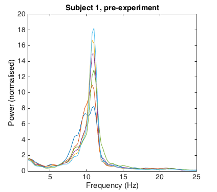
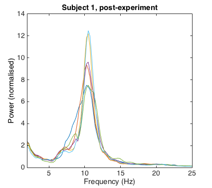
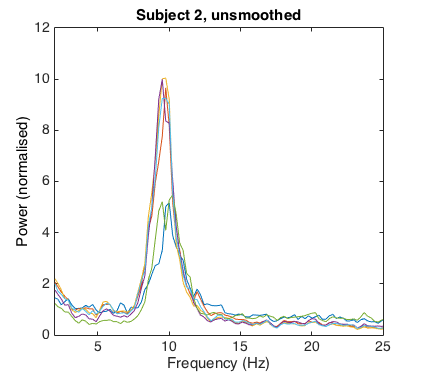
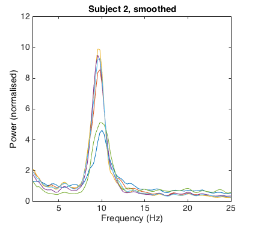
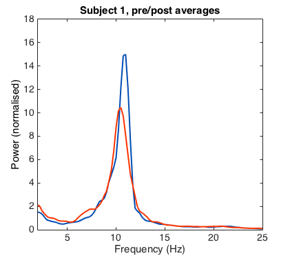
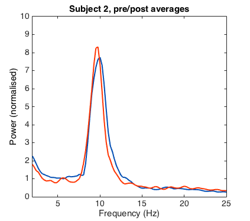

# Tutorial: running `restingIAF`

## Introduction
This brief tutorial is designed to familiarise you with the functions provided in the `restingIAF` package, and demonstrate how these functions might be integrated within an analysis script for EEGLAB.

## Data files and preprocessing
We provide 3 sets of eyes-closed resting-state EEG recordings (pre- & post-experiment; see Table 1).
These files have been preprocessed in EEGLAB and saved as .set files.
More information about this study, including minimially-processed versions of the data files included here, can be accessed from [figshare](https://figshare.com/articles/Muspelheim_data/3412312).

Table 1: Data files included in the tutorial and corresponding source files.

| Processed | Source |
|---|---|
| tute_01_1 | ali0039_azv |
| tute_01_2 | ali0039_azn |
| tute_02_1 | ali0038_azv |
| tute_02_2 | ali0038_azn |
| tute_03_1 | ali0037_azv |
| tute_03_2 | ali0037_azn |

These files have been preprocessed to provide similar data to that reported in the empirical EEG dataset analysis of Corcoran et al. (2017).
Recordings from 6 parietal leads were selected and trimmed to a 2 min duration.
Data were bandpass filtered using a FIR filter with a 1--40 Hz passband.
They were then downsampled from 500 Hz to 250 Hz, resulting in channel vectors consisting of 30001 data points each.

## Analysis parameters
The `tutorial` script is designed to perform a self-contained analysis of the provided datasets (note however that some minor editing may be required in order to ensure that the script can find EEGLAB and the relevant files/functions).
Analysis parameters are set to analyse both recordings of both participants, searching for evidence of alpha peaks in the range of 7--13 Hz.
Number of channels required to generate cross-channel averages ($cMin$) is set to 3, and can be set to any value between 1 and 6 (with 6 being the most stringent, requiring IAF estimates from all included channels).

For simplicity, the tutorial script implements a 'default' version of `restingIAF`, and does not specify various optional inputs pertaining to the configuration of the Savitzky-Golay filter and the `pwelch` routine.
These parameter settings can be adjusted by passing additional inputs to the `restingIAF` function (see help documentation).

## IAF summary estimates
The tutorial script computes channel-wise estimates of PAF and CoG for eligible channels, averages these estimates per recording, and grand-averages these estimates to render a single PAF and CoG summary statistic per participant.
We have included code which collates these summary statistics, along with additional information pertaining to the number of channels included in the analysis, and the standard deviation of channel estimates, in the table that is output to the console.
This output should correspond to that displayed in Table 2.

Table 2: IAF summary statistic output furnished by tutorial script. **S**: subject number; **PAF**: grand-averaged peak alpha frequency; **sd1** and **sd2**: standard deviation of channel-wise PAF estimates (1st and 2nd recording, respectively); **nPafs1** and **nPafs2**: number of PAF estimates (1st and 2nd recording, respectively); **CoG**: grand-averaged alpha frequency centre of gravity; **sd_1** and **sd_2**: standard deviation of channel-wise CoG estimates (1st and 2nd recording, respectively); **nGravs1** and **nGravs2**: number of individualised alpha-band window estimates (1st and 2nd recording, respectively).

| S | PAF | sd1 | sd2 | nPafs1 | nPafs2 | CoG | sd_1 | sd_2 | nGravs1 | nGravs2 |
|---|---|---|---|---|---|---|---|---|---|---|
| 1 | 10.675 | 0.13372 | 0.10918 | 5 | 5 | 10.229 | 0.21824 | 0.16021 | 6 | 6 |
| 2 | 9.7659 | 0.3245 | 0.21837 | 6 | 6 | 9.6555 | 0.11511 | 0.12073 | 6 | 6 |
| 3 | 11.832 | 0.14095 | NaN | 4 | 2 | 10.762 | 0.044185 | 0.20114 | 6 | 4 |

## Extracting channel data
The data furnished in the above output table derives from data contained in the *pSpec.sums* structure, which comprises summary statistics from each analysed recording (e.g., *pSpec(1,1).sums* corresponds to the summary data for Subject 1, recording 1).
A companion structure, *pSpec.chans*, contains information used to calculate these summary statistics.
This data can be used to retrieve channel-specific alpha-band properties (e.g., channel PAF/CoG estimates, individual alpha-band window bounds), and to plot smoothed and unsmoothed power spectral density estimates (see *Visualising power spectra*).
A summary of the channel data that can be accessed from *pSpec.chans* is provided in Table 3.

Note, only 2 PAF estimates were extracted from the post-experiment channel data for subject 03, which falls short of the $cMin$ threshold for cross-channel averaging.
Consequently, the grand average PAF returned in the output table reflects the weighted average from the pre-experiment recording only (notice that the standard deviation for the second set of recordings returns NaN in the absence of any cross-channel mean PAF estimate).
Re-running the script with $cMin$ set to 2 results in the computation of cross-channel mean PAF for the post-experiment recording, thus altering the grand average (11.572 Hz).
Notice that CoG estimates remain unaffected by this manipulation.

Table 3: Key explaining fields within *pSpec.chans* data structure (see Corcoran et al., 2017, for further explanation).

| Field | Data type | Variable |
|---|---|---|
| *pxx* | Numeric vector | Unsmoothed PSD (i.e. `pwelch`-generated PSD estimate) |
| *minPow* | Numeric vector | Threshold values for *minP* parameter |
| *d0* | Numeric vector | Smoothed PSD |
| *d1* | Numeric vector | 1st-derivative of smoothed PSD |
| *d2* | Numeric vector | 2nd-derivative of smoothed PSD |
| *peaks* | Scalar | PAF estimate |
| *pos1* | Scalar | $f_1$ estimate |
| *pos2* | Scalar | $f_2$ estimate |
| *f1* | Integer | Frequency bin indexing *pos1* |
| *f2* | Integer | Frequency bin indexing *pos2* |
| *inf1* | Scalar | $i_1$ estimate |
| *inf2* | Scalar | $i_2$ estimate |
| *Q* | Scalar | Area under the peak bound by $[i_1,i_2]$ |
| *Qf* | Scalar | *Q*-weight |
| *gravs* | Scalar | CoG estimate |
| *selP* | Logical | Selected for cross-channel PAF averaging |
| *selG* | Logical | Selected for cross-channel CoG averaging |

## Visualising power spectra
We have included two simple plotting functions, `plotSpec` and `plotAvSpec`, for visualising channel-wise PSD estimates and their Q-weighted averages.
Plotting spectral estimates may prove useful for evaluating how well the Savitzky-Golay smoothing routine is performing.
Example plots generated from the channel estimates derived above are displayed in Figures 1 and 2.
Comparisons of weighted channel spectra from pre- and post-experiment recordings are displayed in Figure 3.
All plotted functions are linearly-scaled.

 

*Figure 1*. Pre- and post-experiment (smoothed) spectral estimates for Subject 1.

Command line: plotSpec(f, pSpec, 1, 1, 'd0', 0); plotSpec(f, pSpec, 1, 2, 'd0', 0)

 

*Figure 2*. Unsmoothed and smoothed spectral estimates (post-experiment recordings) for Subject 2.

Command line: plotSpec(f, pSpec, 2, 2, 'pxx', 0); plotSpec(f, pSpec, 2, 2, 'd0', 0)

 

*Figure 3*. Pre- (blue) and post- (red) experiment averages from Subjects 1 and 2.

Command line: plotAvSpec(f, pSpec, 1, 0); plotAvSpec(f, pSpec, 2, 0)
